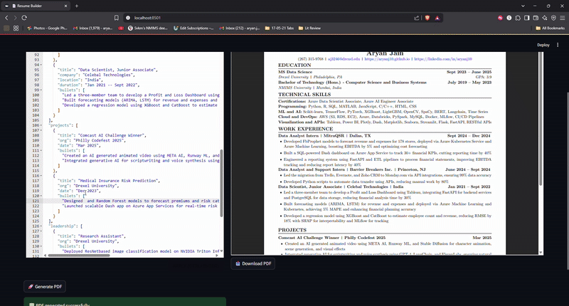

# 🧠 Resume Builder (LaTeX + Streamlit + JSON)

This project is a customizable resume builder where you can:

- 📝 Edit your resume content in a JSON file (via a Streamlit UI)
- 📄 Automatically generate a PDF resume using a LaTeX template
- 🔁 See a live preview and download your resume instantly
- 📜 Track every change with timestamped logs
- 🔍 Review a unified diff of edits across versions

---

## 📸 Preview



---

## 🚫 Deployment Note

This project is not deployed on a free platform because it requires LaTeX for PDF generation, which significantly increases the Docker image size. Most free-tier services (like Streamlit Cloud or Render) impose limits on memory and container size, making it impractical to host.

However, you can easily run it locally or in the cloud using Docker.

---

## 🐳 Run with Docker

### 1. Build the Docker Image
```bash
docker build -t resume-builder .
```

### 2. Run the Container
```bash
docker run -p 8080:8080 resume-builder
```

### 3. Open in Browser
Open [http://localhost:8080](http://localhost:8080) to use the app.

---

## 🚀 Features

- ✍️ **JSON-based resume editor** — Easily edit your content in a structured format
- 📄 **LaTeX formatting** — Professionally styled output with full typography control
- 📤 **Live PDF preview** — Instantly view the output as you make edits
- 💾 **Download-ready PDF**
- 🧠 **Change logs** — Every time you generate a PDF:
  - Logs the diff of what was edited
  - Includes timestamp, resume variant, and only changed lines
- 📜 **Log viewer** tab in the UI — Review recent edits sorted from newest to oldest

---

## 📂 Output Format

The PDF output is defined by the LaTeX template in:

```
template/resume_template.tex
```

To customize visual styling (fonts, sections, spacing), modify the `.tex` file.

---

## 🧪 Example Log Entry

```diff
--- 2025-06-19 14:20:51 ---
Variant: main, Publication: Yes
Changes:
@@ -12,7 +12,7 @@
-    "degree": "M.S. in Data Science",
+    "degree": "MS Data Science",
```

---

## 🛠 How to Run Locally

### 1. Clone the repo
```bash
git clone https://github.com/aryanj10/resume-editor-generate.git
cd resume-editor-generate
```

### 2. Install requirements
```bash
pip install -r requirements.txt
```

### 3. Run the app
```bash
streamlit run streamlit_app.py
```

---

## 📁 File Structure

```
resume_project/
├── resume_data/
│   └── main/resume_data.json         # Your editable JSON resume
├── template/
│   └── resume_template.tex           # LaTeX resume layout
├── output/
│   └── main/Aryan_Jain_Resume.pdf   # Generated PDFs
├── logs/
│   └── main/change_log.txt           # Timestamped change logs (diff only)
├── utils/
│   └── render.py                     # Jinja2 + pdflatex PDF generator
├── streamlit_app.py                  # Streamlit UI
└── requirements.txt
```

---

## ⚙ Requirements

- Python 3.9+
- Streamlit, Jinja2 (install with `pip install -r requirements.txt`)
- `pdflatex` for LaTeX PDF generation
  - **Windows**: [MiKTeX](https://miktex.org/download)
  - **macOS**: [MacTeX](https://tug.org/mactex/)
  - **Linux**: `sudo apt install texlive-full`

---

## 🧠 Coming Soon

- Section-specific WYSIWYG form editors
- Revert to previous log snapshot
- GitHub Actions for automatic PDF builds

---

## 👨‍💻 Built By

**Aryan Jain**  
M.S. Data Science @ Drexel University  
🔗 [LinkedIn](https://linkedin.com/in/aryanj10) · 🌐 [Website](https://aryanj10.github.io)
